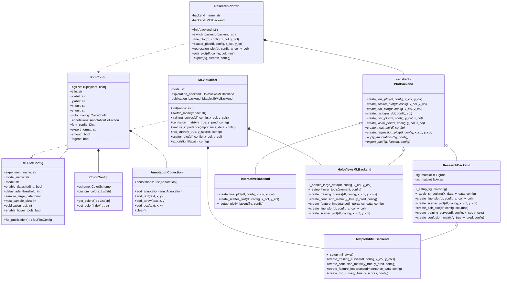
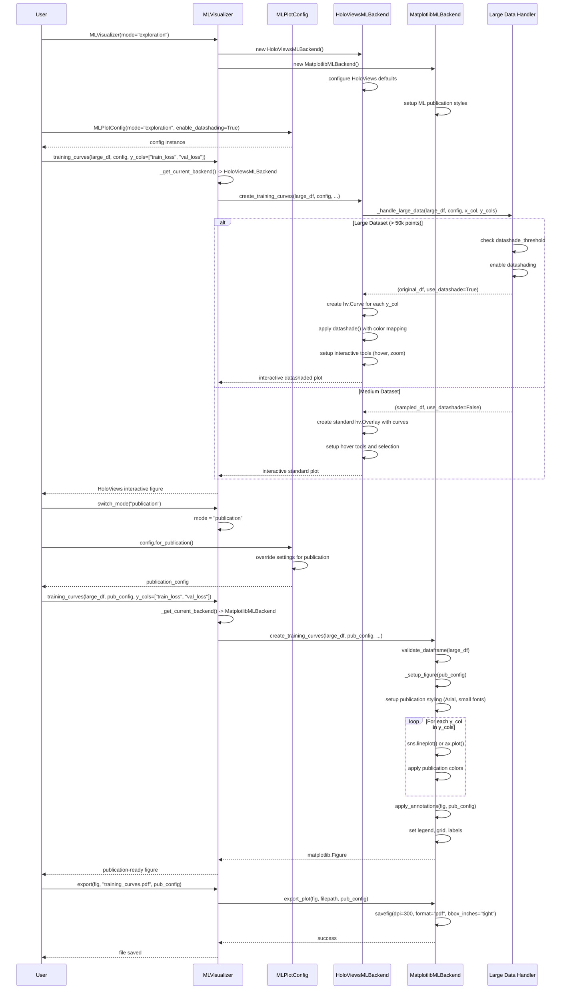

# ures.plot - Advanced Research Plotting Library

A comprehensive, multi-backend visualization library designed for scientific research, data analysis, and machine learning, built on Polars DataFrames with matplotlib/seaborn, plotly, and HoloViews backends.

## Overview

ures.plot provides a unified interface for creating publication-quality static plots, interactive visualizations, and high-performance ML exploration charts. It supports 21+ traditional plot types plus specialized ML visualizations through a flexible dual-track backend system.

## Installation

```bash
# Core dependencies
pip install matplotlib polars numpy

# Enhanced research plotting
pip install seaborn scipy statsmodels

# Interactive visualization
pip install plotly kaleido

# ML exploration (high-performance)
pip install holoviews bokeh datashader panel

# ML analysis
pip install scikit-learn
```

## Quick Start

### Traditional Research Plotting
```python
import polars as pl
from ures.plot import ResearchPlotter, PlotConfig

# Create sample data
df = pl.DataFrame({
    "x": range(10),
    "y": [i**2 + i for i in range(10)],
    "category": ["A"] * 5 + ["B"] * 5
})

# Initialize plotter
plotter = ResearchPlotter(backend="research")  # or "interactive"

# Create configuration
config = PlotConfig(
    title="Sample Plot",
    xlabel="X Values",
    ylabel="Y Values",
    figsize=(10, 6)
)

# Create plots
fig = plotter.line_plot(df, config, "x", "y")
fig = plotter.scatter_plot(df, config, "x", "y")
fig = plotter.regression_plot(df, config, "x", "y")
```

### ML Visualization (Dual-Track System)
```python
import polars as pl
import numpy as np
from ures.plot.ml import MLVisualizer, MLPlotConfig

# Create ML data
train_data = pl.DataFrame({
    "epoch": range(1, 101),
    "train_loss": np.exp(-np.arange(100) * 0.05) + np.random.normal(0, 0.02, 100),
    "val_loss": np.exp(-np.arange(100) * 0.03) + np.random.normal(0, 0.03, 100),
    "train_acc": 1 - np.exp(-np.arange(100) * 0.04) + np.random.normal(0, 0.01, 100),
    "val_acc": 1 - np.exp(-np.arange(100) * 0.035) + np.random.normal(0, 0.015, 100)
})

# Exploration mode (HoloViews - fast, interactive)
ml_viz = MLVisualizer(mode="exploration")
config = MLPlotConfig(title="Training Progress", mode="exploration")

fig = ml_viz.training_curves(train_data, config,
                           y_cols=["train_loss", "val_loss"])
fig.show()  # Interactive plot in browser

# Publication mode (Matplotlib - high-quality, static)
ml_viz.switch_mode("publication")
pub_config = config.for_publication()  # Auto-optimize for publication

fig = ml_viz.training_curves(train_data, pub_config,
                           y_cols=["train_loss", "val_loss"])
ml_viz.export(fig, "training_curves.pdf", pub_config)
```

## Library Structure
```
ures/plot/
├── __init__.py            # Main package exports
├── ml.py               # Machine learning utilities (if applicable)
backend/
    ├── __init__.py          # Backend package exports
    ├── plotter.py           # ResearchPlotter class and backend switching logic
    ├── config.py            # Configuration management for plots
    ├── annotations.py        # Annotation management system
    ├── color_config.py       # Color scheme management
    └── utils.py             # Utility functions for plotting
```

## Architecture

### Class Diagram


### Sequence Diagram - ML Dual-Track Visualization


## Core Components

### 1. Traditional Research Plotting

**PlotConfig**: Main configuration class for standard research plots
```python
config = PlotConfig(
    title="Research Results",
    xlabel="Time (days)", ylabel="Response (mV)",
    x_unit="days", y_unit="mV",
    figsize=(12, 8),
    style="whitegrid",
    font_config={
        "title_size": 16,
        "label_size": 14,
        "tick_size": 12
    }
)
```

### 2. ML Dual-Track System

**MLPlotConfig**: Extended configuration for ML workflows
```python
from ures.plot.ml import MLPlotConfig

# Exploration mode - fast, interactive
config = MLPlotConfig(
    title="Model Training",
    mode="exploration",
    enable_datashading=True,
    datashade_threshold=50000,
    enable_hover_tools=True
)

# Publication mode - high-quality, static
pub_config = config.for_publication()  # Auto-optimizes settings
```

**Dual-Track Workflow**:
```python
from ures.plot.ml import MLVisualizer

# Exploration: HoloViews + Datashader (Speed + Interactivity)
ml_viz = MLVisualizer(mode="exploration")

# Publication: Matplotlib + Seaborn (Quality + Control)
ml_viz.switch_mode("publication")
```

### 3. Large Dataset Handling

**Automatic Data Processing**:
```python
# Large dataset (>50k points) - auto-datashading
large_df = pl.DataFrame({
    "x": np.random.randn(100000),
    "y": np.random.randn(100000),
    "category": np.random.choice(["A", "B", "C"], 100000)
})

# Exploration mode: Uses datashading for performance
config = MLPlotConfig(enable_datashading=True, datashade_threshold=50000)
fig = ml_viz.scatter_plot(large_df, config, "x", "y", color_col="category")

# Publication mode: Samples data for quality
pub_config = config.for_publication()  # Disables datashading
fig = ml_viz.scatter_plot(large_df, pub_config, "x", "y", color_col="category")
```

## Usage Examples by Component

### Traditional Research Plotting

**Line Plot with Annotations**:
```python
from ures.plot import ResearchPlotter, PlotConfig

plotter = ResearchPlotter(backend="research")
config = PlotConfig(title="Temperature Monitoring", xlabel="Time", ylabel="Temperature (°C)")

# Add annotations
config.annotations.add_arrow("Peak Temperature", x=12.5, y=42.3, xy_text=(14, 45))
config.annotations.add_box("Critical Zone", x=18, y=38,
                          bbox_props={"boxstyle": "round", "facecolor": "yellow"})

fig = plotter.line_plot(df, config, "time", "temperature")
```

**Correlation Analysis**:
```python
# Heatmap with custom colors
config = PlotConfig(title="Feature Correlations")
config.color_config.scheme = ColorScheme.VIRIDIS

fig = plotter.heatmap(df, config, correlation=True, annot=True)
```

### ML Exploration Mode (HoloViews)

**Interactive Training Curves**:
```python
from ures.plot.ml import MLVisualizer, MLPlotConfig

ml_viz = MLVisualizer(mode="exploration")
config = MLPlotConfig(
    title="Training Progress",
    mode="exploration",
    enable_hover_tools=True,
    enable_selection_tools=True
)

# Interactive plot with hover data
fig = ml_viz.training_curves(
    train_df, config,
    x_col="epoch",
    y_cols=["train_loss", "val_loss", "train_acc", "val_acc"]
)
fig.show()  # Opens in browser
```

**High-Performance Scatter Plot**:
```python
# Handles 100k+ points with datashading
config = MLPlotConfig(
    enable_datashading=True,
    datashade_threshold=10000
)

fig = ml_viz.scatter_plot(
    large_embeddings_df, config,
    "x", "y",
    color_col="cluster_id"
)
```

**Feature Importance Visualization**:
```python
importance_data = {
    "feature_1": 0.45,
    "feature_2": 0.32,
    "feature_3": 0.28,
    # ... more features
}

fig = ml_viz.feature_importance(importance_data, config, top_n=15)
```

### ML Publication Mode (Matplotlib)

**Publication-Ready Training Curves**:
```python
ml_viz.switch_mode("publication")
pub_config = MLPlotConfig().for_publication()

fig = ml_viz.training_curves(train_df, pub_config,
                           y_cols=["train_loss", "val_loss"])
ml_viz.export(fig, "training_curves.pdf", pub_config)
```

**Confusion Matrix**:
```python
import numpy as np

y_true = np.array([0, 1, 2, 2, 1, 0, 1, 2])
y_pred = np.array([0, 2, 1, 2, 1, 0, 1, 2])
class_names = ["Class A", "Class B", "Class C"]

fig = ml_viz.confusion_matrix(y_true, y_pred, pub_config, class_names)
```

**ROC Curve Analysis**:
```python
# Binary classification ROC curve
y_true_binary = np.array([0, 0, 1, 1, 0, 1, 1, 0])
y_scores = np.array([0.1, 0.4, 0.35, 0.8, 0.65, 0.9, 0.7, 0.2])

fig = ml_viz.roc_curve(y_true_binary, y_scores, pub_config)
ml_viz.export(fig, "roc_curve.png", pub_config)
```

### Backend Comparison

| Feature | Research Backend | Interactive Backend | ML Exploration | ML Publication |
|---------|------------------|-------------------|----------------|----------------|
| **Library** | Matplotlib + Seaborn | Plotly | HoloViews + Datashader | Matplotlib + Seaborn |
| **Performance** | Good | Good | Excellent (100k+ points) | Good |
| **Interactivity** | None | Full | Full + Tools | None |
| **Publication Quality** | Excellent | Good | Fair | Excellent |
| **Large Data** | Limited | Limited | Optimized | Sampling |
| **Export Formats** | PNG, PDF, SVG | PNG, PDF, HTML | PNG, HTML | PNG, PDF |

### Advanced ML Workflows

**Complete ML Experiment Visualization**:
```python
from ures.plot.ml import MLVisualizer, MLPlotConfig

# Initialize dual-mode visualizer
ml_viz = MLVisualizer(mode="exploration")

# Experiment tracking
config = MLPlotConfig(
    experiment_name="bert_finetuning",
    model_name="bert-base-uncased",
    mode="exploration"
)

# 1. Training curves (exploration)
training_fig = ml_viz.training_curves(metrics_df, config,
                                    y_cols=["train_loss", "val_loss", "f1_score"])

# 2. Feature importance (exploration)
importance_fig = ml_viz.feature_importance(feature_weights, config)

# 3. Switch to publication mode
ml_viz.switch_mode("publication")
pub_config = config.for_publication()

# 4. Generate publication plots
final_training = ml_viz.training_curves(metrics_df, pub_config,
                                      y_cols=["train_loss", "val_loss"])
final_confusion = ml_viz.confusion_matrix(y_test, y_pred, pub_config, class_names)

# 5. Export for paper
ml_viz.export(final_training, "figure1_training.pdf", pub_config)
ml_viz.export(final_confusion, "figure2_confusion.pdf", pub_config)
```

## Dependency Management

The library gracefully handles optional dependencies:

```python
from ures.plot.backend.deps import check_dependencies

check_dependencies()

# Output shows ML capabilities:
# Research Plotting Dependencies:
# ========================================
# - Matplotlib: ✓ (required - core plotting)
# - Polars: ✓ (required - data handling)
# - NumPy: ✓ (required - numerical operations)
#
# Optional Dependencies:
# -------------------------
# - Seaborn: ✓ (optional - enhanced research plots)
# - Plotly: ✓ (optional - interactive visualization)
# - HoloViews: ✓ (optional - ML exploration)
# - Datashader: ✓ (optional - large data visualization)
# - Scikit-learn: ✓ (optional - ML metrics)
```

## Complete Feature Matrix

### Traditional Research Plots (21 types)

| Category | Plot Types | Methods | Backend Support |
|----------|------------|---------|----------------|
| **Basic** | Line, Scatter, Bar, Histogram, Box, Violin | `line_plot()`, `scatter_plot()`, etc. | Research + Interactive |
| **Multi-dimensional** | Heatmap, Bubble, Radar, Parallel Coordinates | `heatmap()`, `bubble_plot()`, etc. | Research + Interactive |
| **Scientific** | Error Bar, Regression, Residual, Q-Q, Density, CDF | `regression_plot()`, `error_bar_plot()`, etc. | Research |
| **Advanced** | Subplot Grid, Pair Plot, Facet Grid | `pair_plot()`, `subplots_grid()`, etc. | Research |
| **Time Series** | Decomposition, ACF/PACF | `time_series_decomposition()`, `acf_pacf_plot()` | Research |

### ML-Specific Visualizations

| Category | Plot Types | Methods | Exploration | Publication |
|----------|------------|---------|-------------|-------------|
| **Training** | Training Curves, Loss Landscapes | `training_curves()` | ✓ HoloViews | ✓ Matplotlib |
| **Evaluation** | Confusion Matrix, ROC/PR Curves | `confusion_matrix()`, `roc_curve()` | ✓ Interactive | ✓ Static |
| **Interpretation** | Feature Importance, SHAP plots | `feature_importance()` | ✓ Interactive | ✓ Static |
| **Data** | Large Scatter, Embeddings | `scatter_plot()` with datashading | ✓ Optimized | ✓ Sampled |

The library provides a complete solution for both traditional research visualization and modern ML workflows, with automatic optimization for different use cases and data scales.
